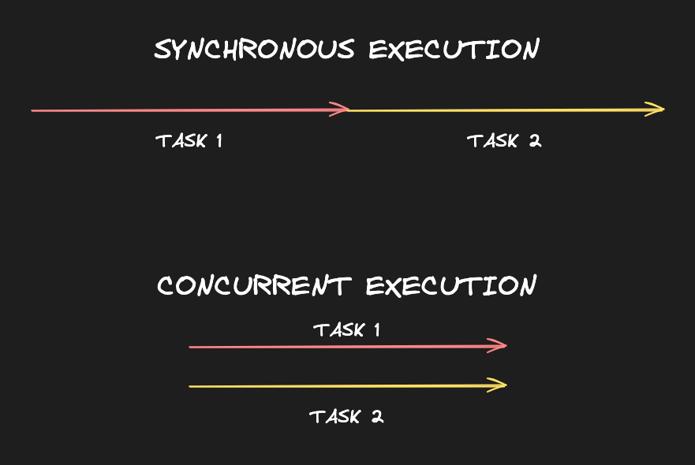

# Concurrency in Go

## What is Concurrency?
Concurrency is the ability to make progress on multiple tasks without waiting for each one to finish before starting the next. Typically, our code is executed one line at a time, one after the other. _This is called sequential execution_ or _synchronous execution_.


If the computer we're running our code on has multiple cores, it can run multiple tasks at exactly the same time. That's called parallelism. On a single core, it switches between tasks very quickly instead. Either way, the code we write looks the same in Go and takes advantage of whatever resources are available.

## How does Concurrency Work in Go?
Go was designed to be concurrent, which is a trait fairly unique to Go. It excels as coordinating many tasks safely using a simple syntax.

There isn't a popular programming language in existence where spawning concurrent execution is quite as elegant, at least in my opinion.

Concurrency is as simple as using the `go` keyword when calling a function:
```go
go doSomething()
```
In the example above, `doSomething()` will be executed concurrently with the rest of the code in the function. The `go` keyword is used to spawn a new [goroutine](https://gobyexample.com/goroutines).

## Assignment
At Textio we send a lot of network requests. Each email we send must go out over the internet. To serve our millions of customers, we need a single Go program to be capable of sending thousands of emails at once.

Edit the `sendEmail()` function to execute its anonymous function concurrently so that the "received" message prints after the "sent" message.